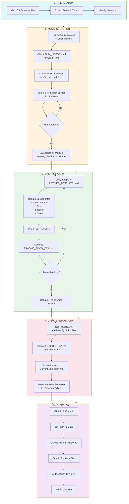

# New Semester Workflow

This document outlines the streamlined process for creating syllabi for a new semester of PSYC 405.

## Quick Start Checklist

- [ ] Tell Claude to create semester materials (see Automated Workflow below)
- [ ] Review and approve movie selections
- [ ] Verify classroom location from Patriot Web
- [ ] Commit and push (auto-deploys to Netlify)
- [ ] Import ICS file to your calendar

---

## Automated Workflow with Claude

Most of the semester setup can be automated by asking Claude Code to help. Here's what Claude can do automatically:

### What Claude Can Automate

| Task | Automation Level | Data Source |
|------|-----------------|-------------|
| Academic calendar dates | **Fully automated** | GMU Registrar website |
| Class times | **Fully automated** | Coursicle/GMU public data |
| ICS file creation | **Fully automated** | Generated from calendar data |
| Movie selection | **Semi-automated** | `~/Class Movies/` + `FILM_HISTORY.md` |
| Syllabus creation | **Fully automated** | Template + gathered data |
| Important dates table | **Fully automated** | GMU Registrar website |
| Classroom location | **Manual required** | Patriot Web (requires login) |

### Sample Prompts for Claude

**Full semester setup:**
```
I need to prepare PSYC 405 for [Fall/Spring] [Year]. I teach two sections
on [Mon/Wed or Tue/Thu]. Please:
1. Get the GMU academic calendar for that semester
2. Create an ICS file with class meetings and important dates
3. Select 8 movies per section from ~/Class Movies/ (check FILM_HISTORY.md for used films)
4. Create syllabi for both sections
5. Update the README and FILM_HISTORY.md
```

**Just the calendar:**
```
Get the GMU [Fall/Spring] [Year] academic calendar and create an ICS file
for PSYC 405. Include class meetings for sections 001 (9:00-10:15 AM) and
002 (10:30-11:45 AM) on Mon/Wed, plus all important academic dates.
```

**Just movie selection:**
```
Select 8 movies for each PSYC 405 section from ~/Class Movies/.
Check FILM_HISTORY.md and the PSYC 325 repo for films already used.
Categorize as Mystery (3), Madness (3), Murder (2).
```

### Data Sources Claude Uses

| Source | URL | What It Provides |
|--------|-----|------------------|
| GMU Registrar | registrar.gmu.edu/calendars/ | Academic dates, deadlines |
| Psychology Dept | psychology.gmu.edu | Course info, instructor profile |
| Coursicle | coursicle.com/gmu/ | Class times (public data) |
| PSYC 325 Repo | github.com/pem725/GMU-PSYC-325-PSYCHOPATHOLOGY | Films to exclude |

### Manual Steps Required

**Classroom location** must be verified manually:
1. Log into [Patriot Web](https://patriotweb.gmu.edu)
2. Navigate to: Student Services → Registration → Look Up Classes
3. Search for PSYC 405 for the relevant semester
4. Note the building and room number
5. Update the ICS file and syllabi with the correct location

---

## Workflow Diagram



---

## Detailed Steps

### Step 1: Preparation

1. **Obtain Calendar File**
   - Get the ICS file from GMU's scheduling system
   - Save as `PSYC_405_[Semester]_[Year].ics` in the repo root
   - Example: `PSYC_405_Spring_2026.ics`

2. **Extract Key Information**
   ```
   - Section numbers (001, 002, etc.)
   - Meeting days (Mon/Wed, Tue/Thu)
   - Times for each section
   - Room/building location
   - Semester start/end dates
   - Break dates (Spring Break, Fall Break)
   ```

### Step 2: Movie Selection

1. **List Available Movies**
   ```bash
   ls ~/Class\ Movies/
   ```

2. **Check Film History**
   - Open `FILM_HISTORY.md`
   - Note all previously used films in PSYC 405
   - Check PSYC 325 repo for cross-listed films:
     https://github.com/pem725/GMU-PSYC-325-PSYCHOPATHOLOGY

3. **Selection Criteria**
   | Module | Themes | Example Films |
   |--------|--------|---------------|
   | Mystery | Perception, memory, deception, identity | Thrillers, noir, psychological suspense |
   | Madness | Mental illness, treatment, institutions | Dramas featuring psychological disorders |
   | Murder | Justice, morality, criminal psychology | Courtroom dramas, crime films |

4. **Allocate Films**
   - 8 films per section (at 1.5 weeks each)
   - 3 Mystery + 3 Madness + 2 Murder
   - Different films for each section

### Step 3: Create Syllabi

1. **Use the Template**
   Copy from an existing syllabus or use this naming convention:
   ```
   PSYC405_[Semester][Year]_[Section].qmd

   Examples:
   - PSYC405_S2026_001.qmd  (Spring 2026, Section 001)
   - PSYC405_F2026_001.qmd  (Fall 2026, Section 001)
   ```

2. **Update Required Fields**
   ```yaml
   ---
   title: "Syllabus for PSYC 405: Mystery, Madness & Murder"
   subtitle: "[Semester Year]: Section [XXX]"
   author: "Patrick E. McKnight"
   ---
   ```

3. **Update Meeting Info**
   - Section number and time
   - Days of week
   - Building and room
   - Semester dates

4. **Insert Film Schedule**
   - Week-by-week table with films
   - IMDB links for each film
   - Quiz numbers

### Step 4: Update Repository Files

1. **Edit `_quarto.yml`**
   Add new syllabi to navigation:
   ```yaml
   - text: "Current Syllabi"
     menu:
       - text: "[Semester Year] - Section 001"
         href: PSYC405_SXXXX_001.qmd
       - text: "[Semester Year] - Section 002"
         href: PSYC405_SXXXX_002.qmd
   ```

2. **Update `FILM_HISTORY.md` / `FILM_HISTORY.qmd`**
   - Add new semester section
   - Add all new films with themes
   - Update alphabetical index
   - Update statistics

3. **Update `index.qmd`**
   - Change "Current Semester" section
   - Update featured films list
   - Update section times/locations

4. **Archive Previous Semester**
   - Move previous "Current" to "Previous Syllabi" in nav

### Step 5: Deploy

1. **Commit Changes**
   ```bash
   git add .
   git commit -m "Add [Semester Year] syllabi for Sections 001 and 002"
   git push origin main
   ```

2. **Automatic Deployment**
   - GitHub Actions triggers on push to main
   - Quarto renders all .qmd files
   - Site deploys to Netlify automatically

3. **Verify**
   - Check the live Netlify URL
   - Test navigation to new syllabi
   - Verify all films are listed correctly

---

## File Naming Convention

```
PSYC405_[S|F][YEAR]_[SECTION].qmd

S = Spring, F = Fall
YEAR = 4-digit year
SECTION = 3-digit section number

Examples:
- PSYC405_S2026_001.qmd
- PSYC405_S2026_002.qmd
- PSYC405_F2026_001.qmd
```

---

## Auto-Deploy Configuration

Netlify is configured to automatically build and deploy when you push to the `main` branch.

### Netlify Build Settings

| Setting | Value |
|---------|-------|
| Repository | `pem725/GMU-PSYC-405-Mystery-Madness-Murder` |
| Branch | `main` |
| Build command | `quarto render` |
| Publish directory | `_site` |

### How It Works

1. Push changes to `main` branch on GitHub
2. Netlify detects the push automatically
3. Netlify runs `quarto render` to build the site
4. Site is deployed to your Netlify URL

### Manual Deployment (if needed)

```bash
# Render locally
quarto render

# Preview locally
quarto preview

# Manual publish to Netlify
quarto publish netlify
```

---

## Troubleshooting

| Issue | Solution |
|-------|----------|
| Build fails | Check `_quarto.yml` syntax, ensure all referenced .qmd files exist |
| Films not showing | Verify IMDB links are correct, check table formatting |
| Navigation broken | Check `_quarto.yml` menu structure and file paths |
| Deploy not triggering | Verify GitHub Actions is enabled, check secrets are set |

---

## Timeline

| When | Task |
|------|------|
| 4 weeks before semester | Obtain ICS, select movies |
| 2 weeks before semester | Create syllabi, update repo |
| 1 week before semester | Verify deployment, test links |
| First day of class | Confirm students can access site |

---

*Last updated: January 2026*
